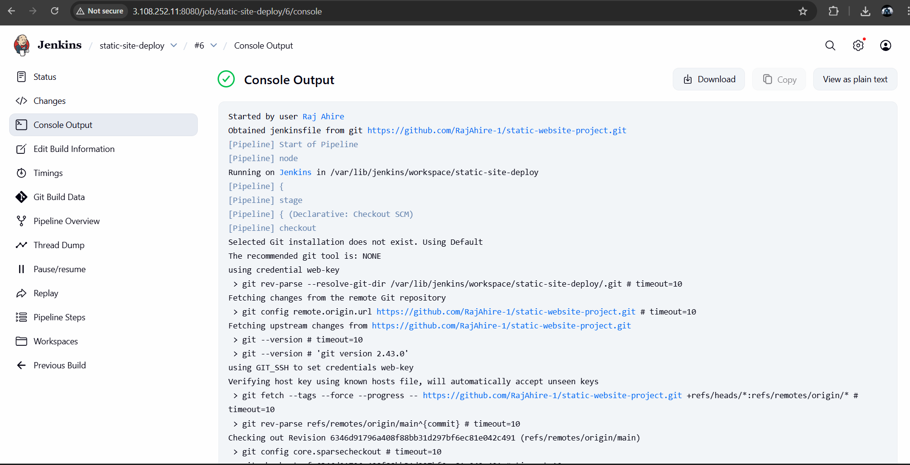
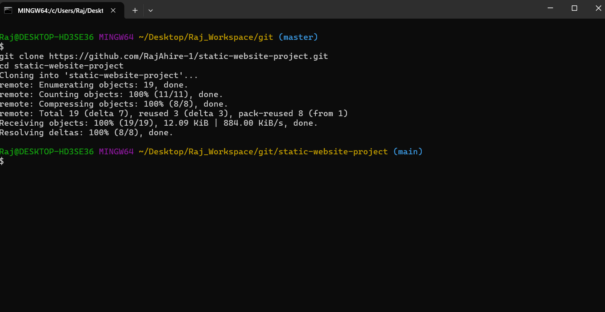
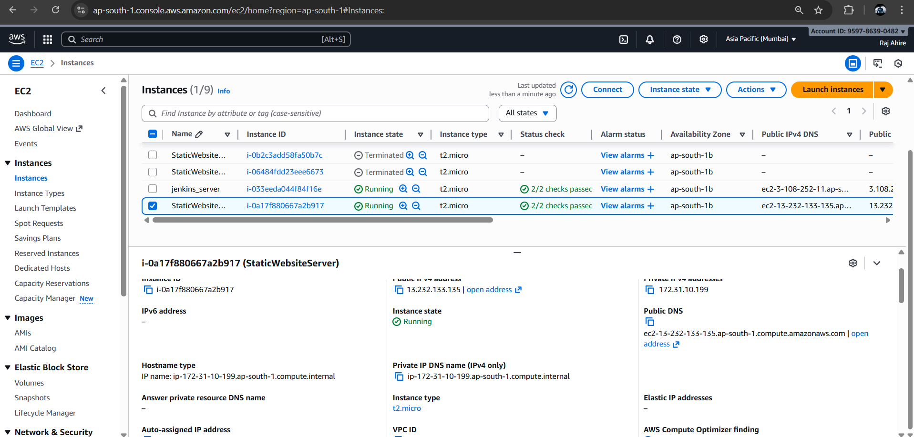
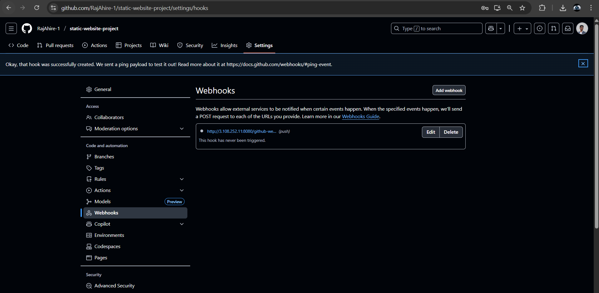

# 🌐 Static Website Deployment Using Terraform & Jenkins (CI/CD Pipeline)

This project demonstrates a **complete DevOps automation workflow** where a static website is deployed to AWS EC2 using **Terraform**, and continuously updated through **Jenkins CI/CD** triggered by **GitHub Webhooks**.

The pipeline ensures:

* 🚀 Automated Infrastructure Provisioning
* 🔁 Automated Build & Deployment
* 🌍 Live Web Delivery through NGINX
* ⚙️ Zero-touch CI/CD using GitHub → Jenkins → EC2
* 📡 Webhook-based auto-trigger on every Git push

---

# 📸 Screenshots (Actual Project Output)

## ✅ Jenkins Pipeline — Successful Deployment



---

## ✅ Git Clone — Local Workspace



---

## ✅ NGINX Status on EC2


---

## ✅ EC2 Server Running



---

## ✅ Final Deployed Website


---

## ✅ GitHub Webhook Integration



---

# 🏗️ Project Architecture

```
Developer → GitHub Push
        ↓ (Webhook)
     Jenkins Pipeline
        ↓
Terraform Infrastructure → EC2 Instance
        ↓
NGINX Server → Live Static Website
```

---

# 🧱 Technologies Used

| Component           | Purpose                         |
| ------------------- | ------------------------------- |
| **Terraform**       | Provision AWS EC2, SG, Key Pair |
| **AWS EC2**         | Host the static website         |
| **NGINX**           | Web server                      |
| **Jenkins**         | CI/CD automation                |
| **GitHub Webhooks** | Auto-trigger Jenkins on push    |
| **Bash Scripts**    | Server configuration            |

---

# 📁 Project Structure

```
static-website-project/
│
├── infra/
│   ├── main.tf
│   ├── variables.tf
│   └── user_data.sh
│
├── Jenkinsfile
│
└── website-files (HTML, CSS, JS)
```

---

# 🧩 Terraform — main.tf

```hcl
provider "aws" {
  region = "ap-south-1"
}

resource "aws_key_pair" "newin" {
  key_name   = "newin"
  public_key = file("C:/Users/Raj/.ssh/newin.pub")
}

resource "aws_security_group" "blog-web" {
  name = "blog-web"

  ingress {
    from_port   = 22
    to_port     = 22
    protocol    = "tcp"
    cidr_blocks = ["0.0.0.0/0"]
  }

  ingress {
    from_port   = 80
    to_port     = 80
    protocol    = "tcp"
    cidr_blocks = ["0.0.0.0/0"]
  }

  ingress {
    from_port   = 8080
    to_port     = 8080
    protocol    = "tcp"
    cidr_blocks = ["0.0.0.0/0"]
  }

  egress {
    from_port   = 0
    to_port     = 0
    protocol    = "-1"
    cidr_blocks = ["0.0.0.0/0"]
  }

  lifecycle {
    create_before_destroy = true
  }

  tags = {
    Name = "blog-web-sg"
  }
}

resource "aws_instance" "bolg-web" {
  ami                    = "ami-02b8269d5e85954ef"
  instance_type          = "t2.micro"
  vpc_security_group_ids = [aws_security_group.blog-web.id]
  key_name               = aws_key_pair.newin.key_name

  user_data = file("${path.module}/user_data.sh")

  tags = {
    Name = "blog-web"
  }
}

output "public_ip"  { value = aws_instance.bolg-web.public_ip  }
output "public_dns" { value = aws_instance.bolg-web.public_dns }
```

---

# 🧩 Bash Script — user_data.sh

```bash
#!/bin/bash
set -euo pipefail
LOG="/var/log/user-data.log"
exec > >(tee -a "$LOG") 2>&1

echo "=== user-data start ==="

REPO_URL="https://github.com/RajAhire-1/static-website-project.git"
WEBROOT="/var/www/html"

apt-get update -y
apt-get install -y git nginx openjdk-17-jdk

systemctl enable --now nginx

if [ -d "${WEBROOT}/.git" ]; then
  git -C "${WEBROOT}" pull --rebase || true
else
  rm -rf "${WEBROOT:?}/"*
  git clone "${REPO_URL}" "${WEBROOT}"
fi

chown -R www-data:www-data "${WEBROOT}"
find "${WEBROOT}" -type d -exec chmod 755 {} \;
find "${WEBROOT}" -type f -exec chmod 644 {} \;

systemctl restart nginx
echo "=== user-data finished ==="
```

---

# 🔄 Jenkinsfile — Complete CI/CD Pipeline

```groovy
pipeline {
  agent any

  environment {
    DEPLOY_USER        = 'ubuntu'
    DEPLOY_HOST        = '13.201.4.66'
    DEPLOY_PATH        = '/var/www/html'
    SSH_CREDENTIALS_ID = 'web-key'
    REPO_URL           = 'https://github.com/RajAhire-1/static-website-project.git'
    BRANCH             = 'main'
  }

  stages {
    stage('Checkout') {
      steps {
        git branch: "${BRANCH}", url: "${REPO_URL}"
      }
    }

    stage('Prepare Remote') {
      steps {
        withCredentials([sshUserPrivateKey(credentialsId: SSH_CREDENTIALS_ID,
                                          keyFileVariable: 'SSH_KEY',
                                          usernameVariable: 'SSH_USER')]) {
          sh """
            ssh -o StrictHostKeyChecking=no -i "$SSH_KEY" ${SSH_USER}@${DEPLOY_HOST} '
              sudo apt-get update -y
              sudo apt-get install -y nginx git
              sudo systemctl enable nginx
              sudo systemctl start nginx
              sudo mkdir -p ${DEPLOY_PATH}
            '
          """
        }
      }
    }

    stage('Upload & Deploy') {
      steps {
        withCredentials([sshUserPrivateKey(credentialsId: SSH_CREDENTIALS_ID,
                                          keyFileVariable: 'SSH_KEY',
                                          usernameVariable: 'SSH_USER')]) {
          sh """
            scp -o StrictHostKeyChecking=no -i "$SSH_KEY" -r * ${SSH_USER}@${DEPLOY_HOST}:/tmp/deploy_payload

            ssh -o StrictHostKeyChecking=no -i "$SSH_KEY" ${SSH_USER}@${DEPLOY_HOST} "
              sudo rm -rf ${DEPLOY_PATH}/*
              sudo mv /tmp/deploy_payload/* ${DEPLOY_PATH}/

              sudo chown -R www-data:www-data ${DEPLOY_PATH}
              sudo find ${DEPLOY_PATH} -type d -exec chmod 755 {} \\;
              sudo find ${DEPLOY_PATH} -type f -exec chmod 644 {} \\;

              sudo systemctl restart nginx
            "
          """
        }
      }
    }

    stage('Smoke Test') {
      steps {
        sh "curl -I http://${DEPLOY_HOST} | head -n 5 || true"
      }
    }
  }

  post {
    success { echo "✅ Deployment succeeded — http://${DEPLOY_HOST}" }
    failure { echo "❌ Deployment failed — check logs" }
  }
}
```

---

# 🚀 Final Outcome

✔️ Terraform provisions EC2
✔️ NGINX auto-installed
✔️ GitHub push → Jenkins auto-trigger
✔️ Jenkins deploys latest website version
✔️ Website live instantly

---

# 👨‍💻 Author

**Raj Ahire**
AWS | DevOps | Terraform | Jenkins | Linux | Automation


Would you like an enhanced version?
